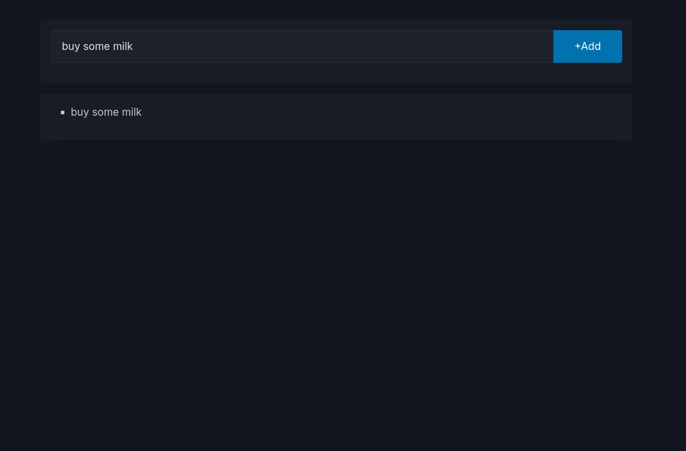

# todo-ui service

Web UI for todo app


## Environment Variables

| Key            | Value  | Mandatory | Sample         |
|----------------|--------|-----------|:---------------|
| PUBLIC_API_URL | string | yes       | localhost:3001 |

## Test

### E2E tests
```bash
  npm run test
```

## Project Architecture

- Project built on Sveltekit for it's simplicity and performance. Project has a single page to process todos.
- Project has a single index page and two sections; İnput-box for item entrance and list box. Each +Add operation sends REST request to backend service and adds the item to list if response code equal 200
- UI Library: [picocss](https://picocss.com/) simple, lightweight and semantic css framework
- UI Testing framework: Playwright, easy to configure and runs smoothly
- E2E Testing: Contract based testing with pact files

### Secreenshot
